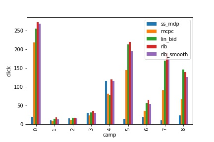
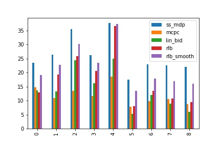

# Optimal Bidding Strategy with Smooth Budget Delivery in Online Advertising

This repository contains the implementation and associated code for the paper **"Optimal Bidding Strategy with Smooth Budget Delivery in Online Advertising"**. This work explores optimal strategies for real-time bidding (RTB) platforms using reinforcement learning and dynamic programming techniques to achieve smooth budget delivery while maximizing campaign objectives like click-through rate (CTR).

## Abstract
Real-time bidding (RTB) is a key mechanism in the online advertising industry, where advertisers compete for ad impressions in real-time auctions. This project presents a new bidding strategy aimed at addressing the following challenges:
1. **Maximizing the number of clicks by visiting users**.
2. **Smooth budget allocation over the campaign period**, avoiding premature budget depletion or excessive spending.

By modeling the bidding process as a **Markov Decision Process (MDP)**, and employing dynamic programming, the proposed strategy adapts to real-time conditions to optimize the bid prices in each auction. The developed algorithm was tested using real-world datasets, demonstrating its superiority over traditional strategies in terms of budget efficiency and click maximization.

## Key Features
- **Reinforcement Learning Framework**: The proposed strategy is structured as an MDP, where each advertiser is regarded as an agent making sequential bidding decisions to maximize long-term rewards.
- **Smooth Budget Delivery**: The approach integrates a penalty term to ensure that the budget is evenly utilized throughout the campaign, avoiding spikes in bid prices.
- **Simulation on Real-World Dataset**: Performance has been evaluated on the iPinYou dataset, containing over 19.5 million impressions and 14.79 thousand clicks, demonstrating its practicality.

## Implementation Details
The codebase includes:
1. **Dynamic Programming-based Bid Optimization**: Implementation of the Bellman optimality equations for determining the optimal bidding prices.
2. **Reinforcement Learning Algorithms**: Comparison with various state-of-the-art strategies such as RLB, MCPC, SS-MDP, and Lin-Bid.
3. **Simulation and Evaluation Scripts**: Tools for evaluating performance on the iPinYou dataset, along with scripts for visualizing results.

### **Note on Dataset**
The dataset used in this study is **not included in the repository** due to its large size. Please download the [iPinYou dataset](https://www.ipinyou.com/download) from the official source and place it in the `data/` directory. Make sure to preprocess the data as outlined in the setup instructions before running the simulations.

## Comparative Analysis
The proposed strategy is compared against several benchmark models:
1. **RLB (Reinforcement Learning Baseline)**: A common baseline model for real-time bidding that ignores budget constraints.
2. **MCPC**: A cost-per-click based model that aims to balance the cost and performance.
3. **SS-MDP**: A variant of Markov Decision Process models without feature vector adaptation.
4. **Lin-Bid**: A linear model widely used in industry settings.

### Comparative Plots
The following plots illustrate the performance of the proposed model compared to the state-of-the-art methods, highlighting improvements in terms of **click-through rate (CTR)**, **win-rate**, and **budget utilization**:

1. **Total Number of Clicks**:
   

2. **Win-Rate Comparison**:
   

3. **Cost Per Mile (CPM) Analysis**:
   

These plots show that our approach not only maximizes the total number of user clicks but also delivers smooth budget utilization and higher efficiency compared to traditional models.

## How to Use
- Clone the repository and set up the environment.
- Download the iPinYou dataset from the provided link.
- Place the dataset in the `data/` directory and preprocess it as required.
- Run the optimization scripts to simulate the proposed bidding strategy.
- Evaluate the performance metrics such as win-rate, cost-per-mile (CPM), and number of clicks.

## Citation
If you use this code in your research, please cite the following paper:

```
@inproceedings{afzali2023optimal,
  title={Optimal Bidding Strategy with Smooth Budget Delivery in Online Advertising},
  author={Afzali, Mohammad and Khosravani, Keykhosro and Babazadeh, Maryam},
  booktitle={Proceedings of the 31st International Conference on Electrical Engineering (ICEE)},
  year={2023},
  publisher={IEEE}
}
```

## Authors
- Mohammad Afzali, McMaster University
- Keykhosro Khosravani, Sharif University of Technology
- Maryam Babazadeh, Sharif University of Technology

For more details, feel free to check the [PDF of the paper](https://ieeexplore.ieee.org/document/10334752/metrics#metrics) 
